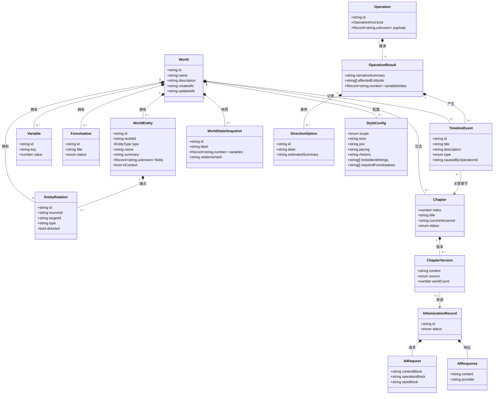
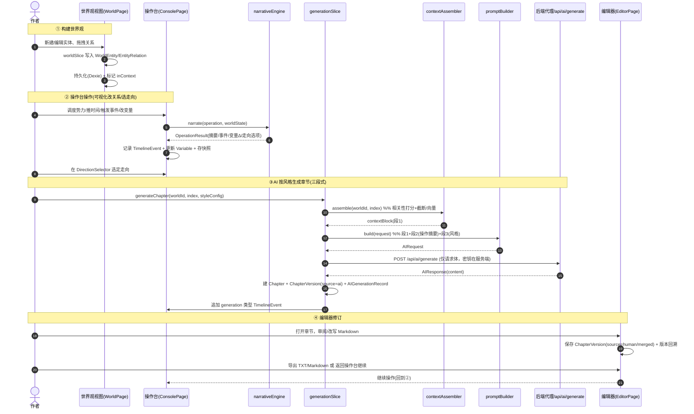
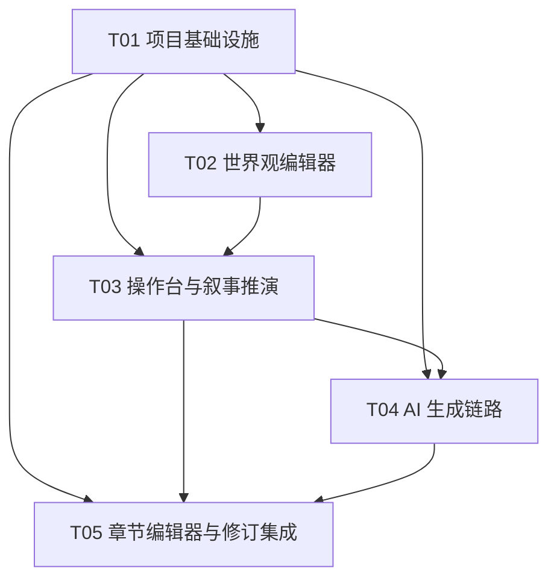

# 系统架构设计文档 · 世界操作系统型小说编辑器

> 代号：`world_novel_editor`
> 文档形态：架构设计 + 任务分解（一次性输出）
> 产出人：架构师（高见远 / Gao）
> 基线：PRD `prd-simple.md` + 主理人确认的 3 项用户决策
> 语言：中文

---

## 一、实现方案与框架选型

### 1.1 技术挑战拆解

| 挑战 | 说明 | 选型应对 |
| --- | --- | --- |
| C1 实体化世界观 + 关系图 | 地理/势力/种族/人物/时间线/规则需结构化且互相关联，可视化拖拽改关系 | React Flow（节点-边图）+ 通用 `WorldEntity`/`EntityRelation` 数据模型 |
| C2 操作台即"轻游戏" | 可视化改关系/选走向驱动叙事，非码字、非聊天 | 独立 `console` 视图 + 轻量规则推演引擎 `narrativeEngine`（不额外调 LLM） |
| C3 共享世界状态、避免分裂 | 操作台与编辑器是同一作品两个视图，必须共享状态 | 单一复合 zustand store（slice 化），全部以 `worldId` 为键，持久化到本地 |
| C4 AI 风格可控 + 上下文注入 | 世界观作为硬约束上下文，长篇小说设定可能超 token | Provider 抽象层 + `contextAssembler`（相关性打分+截断/向量检索）+ 三段式 prompt |
| C5 密钥安全 | 禁止前端硬编码密钥 | 轻量后端代理持有 env 密钥，前端只调 `/api/ai/generate` |
| C6 本地优先 + 跨端同步 | 首版 Web 优先，P1 再上云同步 | Dexie(IndexedDB) 本地优先；`syncService` 预留云同步接口（P1 接入） |

### 1.2 框架与库选型（默认栈 + 补充）

- **构建/框架**：Vite + React 18 + TypeScript（首版 Web 优先，一套代码 PC/移动同构，移动端用响应式简化视图）
- **UI 组件**：MUI v5（业务组件）+ Tailwind CSS（布局/原子类，与 MUI 不冲突，Tailwind 仅用于间距/栅格）
- **状态管理**：**Zustand**（轻量、slice 友好、易持久化；比 Redux 心智负担小，比 Context 性能好）
- **路由**：React Router v6（同一作品下 `world / console / chapters / editor` 路由，共享 store）
- **关系图编辑**：**React Flow**（`reactflow`）——可视化拖拽节点/边，关系变更即触发事件日志与叙事推演
- **本地持久化**：**Dexie**（IndexedDB 封装，支持大世界观、离线优先、查询便捷）
- **Markdown 编辑器**：**@uiw/react-md-editor**（轻量、GitHub 风格、可编辑可预览，满足 P0-4 修订）
- **AI Provider 抽象**：前端定义 `AIProvider` 接口；后端代理用 `openai`（兼容 DeepSeek baseURL）、`@anthropic-ai/sdk`（Claude）
- **校验/共享 schema**：**Zod**（世界观实体、风格参数、prompt 模板的运行时校验，落实"共享知识"约束）
- **ID**：`nanoid`（实体/章节/事件唯一 ID）

### 1.3 架构总览（分层）

```
┌─────────────────────────── 视图层 (View) ───────────────────────────┐
│  WorldPage(世界树/关系图) │ ConsolePage(操作台) │ EditorPage(编辑器)  │
└─────────────────────────────────────────────────────────────────────┘
            │ 调用            │ 调用                │ 调用
┌─────────────────────────── 状态层 (Store) ──────────────────────────┐
│  useWorkStore = worldSlice + consoleSlice + chapterSlice + bookSlice │
│                 + styleSlice + generationSlice  （全部以 worldId 为键）│
└─────────────────────────────────────────────────────────────────────┘
       │ 持久化(订阅)                      │ 编排
┌──────────── 持久化层 ───────────┐  ┌────── 服务层 (Service) ──────────┐
│  Dexie (IndexedDB)             │  │ narrativeEngine / contextAssembler │
│  syncService(P1 云同步接口)     │  │ promptBuilder / aiProvider 抽象     │
└────────────────────────────────┘  └───────────────┬──────────────────┘
                                                     │ fetch /api/ai/generate
                                          ┌──────── 后端轻代理 server/ ────────┐
                                          │ 持有密钥(env) → OpenAI/DeepSeek/Claude │
                                          └──────────────────────────────────────┘
```

> **关键约束落实**：操作台与编辑器共享同一个 `useWorkStore`（同一 `worldId`），状态永不分裂；AI 生成只写入 `ChapterVersion`，作者保留最终裁定权。

---

## 二、文件列表（前端工程结构，含分层）

```
world_novel_editor/
├── index.html
├── package.json
├── vite.config.ts
├── tsconfig.json
├── tsconfig.node.json
├── tailwind.config.js
├── postcss.config.js
├── .env.example                      # VITE_API_BASE 等前端可读变量（不含密钥）
├── README.md
├── src/
│   ├── main.tsx
│   ├── App.tsx
│   ├── router.tsx
│   ├── theme/
│   │   └── theme.ts                  # MUI 主题 + Tailwind 共存配置
│   ├── types/                        # 共享类型（跨文件契约）
│   │   ├── world.ts                  # World, WorldEntity, EntityRelation, Variable, Foreshadow
│   │   ├── timeline.ts               # TimelineEvent, WorldStateSnapshot
│   │   ├── console.ts                # Operation, OperationResult, DirectionOption
│   │   ├── chapter.ts                # Chapter, ChapterVersion
│   │   ├── style.ts                  # StyleConfig
│   │   ├── ai.ts                     # AIProviderConfig, AIRequest, AIResponse, AIGenerationRecord
│   │   └── index.ts
│   ├── schemas/                      # Zod 运行时校验（共享知识落地）
│   │   ├── worldSchema.ts
│   │   ├── styleSchema.ts
│   │   └── promptSchema.ts
│   ├── store/
│   │   ├── workStore.ts              # 复合 store（slice 组合 + persist）
│   │   ├── worldSlice.ts
│   │   ├── consoleSlice.ts
│   │   ├── chapterSlice.ts
│   │   ├── bookSlice.ts              # 作品（Book）层：World 与 Chapter 的中间层
│   │   ├── characterSlice.ts         # 角色系统：总库/角色卡/心情时间线（v2 P3）
│   │   ├── styleSlice.ts
│   │   └── generationSlice.ts
│   ├── services/
│   │   ├── storage/
│   │   │   ├── db.ts                 # Dexie 表定义
│   │   │   └── persistence.ts        # store↔db 订阅同步
│   │   ├── ai/
│   │   │   ├── provider.ts           # AIProvider 接口 + 工厂
│   │   │   ├── openaiProvider.ts     # 兼容 DeepSeek(baseURL)
│   │   │   ├── claudeProvider.ts
│   │   │   ├── contextAssembler.ts   # 世界观上下文检索/截断/向量(P1)
│   │   │   ├── promptBuilder.ts      # 三段式 prompt 组装
│   │   │   └── index.ts
│   │   ├── narrative/
│   │   │   └── narrativeEngine.ts    # 基于世界状态+操作的轻量推演
│   │   └── sync/
│   │       └── syncService.ts        # 云同步接口（P1 实现，v1 留桩）
│   ├── components/
│   │   ├── world/
│   │   │   ├── WorldTree.tsx          # 世界树侧栏
│   │   │   ├── EntityDetailPanel.tsx  # 实体详情/字段编辑
│   │   │   ├── EntityRelationGraph.tsx# React Flow 关系图
│   │   │   └── EntityForm.tsx
│   │   ├── console/
│   │   │   ├── OperationConsole.tsx   # 操作台主视图
│   │   │   ├── OperationPalette.tsx   # 操作面板(调度/推时间/事件/变量)
│   │   │   ├── EventFeed.tsx          # 事件流
│   │   │   ├── VariablePanel.tsx      # 国力/民心/灵气 变量
│   │   │   └── DirectionSelector.tsx  # 走向选择
│   │   ├── generation/
│   │   │   ├── GenerationPanel.tsx    # 生成入口+预览
│   │   │   ├── StyleConfigPanel.tsx   # 描写风格配置
│   │   │   └── GenerationPreview.tsx
│   │   ├── editor/
│   │   │   ├── ChapterEditor.tsx      # Markdown 编辑
│   │   │   ├── ChapterSidebar.tsx     # 大纲/世界状态/伏笔/风格
│   │   │   └── VersionHistory.tsx     # 版本回溯
│   │   ├── timeline/
│   │   │   └── TimelineView.tsx       # 时间线/事件日志(P1 强化)
│   │   ├── layout/
│   │   │   ├── AppShell.tsx
│   │   │   ├── WorkSwitcher.tsx
│   │   │   └── NavRail.tsx
│   │   └── common/
│   │       ├── ConfirmDialog.tsx
│   │       └── ExportMenu.tsx         # 导出 TXT/Markdown
│   ├── pages/
│   │   ├── WorldPage.tsx
│   │   ├── ConsolePage.tsx
│   │   ├── ChapterListPage.tsx
│   │   ├── EditorPage.tsx
│   │   ├── CharacterPage.tsx          # 角色系统：四标签（总库/本卷角色卡/心情/跨书联动）
│   │   └── SettingsPage.tsx
│   ├── hooks/
│   │   ├── useGeneration.ts
│   │   ├── useWorldState.ts
│   │   └── useAutosave.ts
│   ├── utils/
│   │   ├── id.ts                     # nanoid 封装
│   │   ├── text.ts                   # 字数统计/截断
│   │   └── promptTemplates.ts        # 三段式 prompt 模板常量
│   └── constants/
│       └── worldTemplates.ts         # 实体类型默认模板
├── server/                           # 后端轻代理（持有密钥，P0 最小实现）
│   ├── index.ts                      # Express 入口
│   ├── aiProxy.ts                    # POST /api/ai/generate
│   └── .env.example                  # OPENAI_KEY / DEEPSEEK_KEY / CLAUDE_KEY
└── docs/
    ├── architecture-design.md
    ├── class-diagram.mermaid
    └── sequence-diagram.mermaid
```

---

## 三、数据模型与接口（类图 / Mermaid + 关键 TS 类型）

### 3.1 关键 TypeScript 类型

```ts
// types/world.ts
type EntityType = 'geography' | 'faction' | 'race' | 'character' | 'timeline' | 'rule';

interface World {
  id: string; name: string; description?: string;
  createdAt: string; updatedAt: string;
}
interface WorldEntity {
  id: string; worldId: string; type: EntityType;
  name: string; summary: string;
  fields: Record<string, unknown>;   // 结构化字段(等级/领地/教义…)
  richText?: string;                  // 富文本描述
  tags: string[];
  inContext: boolean;                 // 是否纳入 AI 上下文(Lorebook 开关)
  createdAt: string; updatedAt: string;
}
interface EntityRelation {
  id: string; worldId: string;
  sourceId: string; targetId: string;
  type: string;                       // 敌对/同盟/从属/亲属…
  label?: string; directed: boolean;
}
interface Variable {
  id: string; worldId: string; key: string; name: string;
  value: number; min?: number; max?: number; unit?: string;
}
interface Foreshadow {
  id: string; worldId: string; title: string;
  plantChapterId?: string;
  status: 'planted' | 'active' | 'resolved'; note?: string;
}

// types/timeline.ts
interface TimelineEvent {
  id: string; worldId: string; chapterId?: string;
  title: string; description: string;
  era?: string; year?: number; season?: string;
  causedByOperationId?: string;
  type: 'operation' | 'system' | 'generation' | 'manual';
  createdAt: string;
}
interface WorldStateSnapshot {
  id: string; worldId: string; label: string; chapterId?: string;
  variables: Record<string, number>;
  relationsHash: string;              // 关系图快照哈希
  entitiesCount: number; createdAt: string;
}

// types/console.ts
type OperationKind = 'dispatch' | 'advanceTime' | 'triggerEvent' | 'adjustVariable' | 'diplomacy';
interface Operation {
  id: string; worldId: string; kind: OperationKind;
  payload: Record<string, unknown>; label: string; createdAt: string;
}
interface OperationResult {
  operationId: string;
  narrativeSummary: string;           // 叙事推演摘要(喂给生成)
  affectedEntityIds: string[];
  newEvents: TimelineEvent[];
  variableDeltas: Record<string, number>;
  proposedDirections: DirectionOption[]; // 推荐走向(供作者选)
}
interface DirectionOption {
  id: string; label: string; description: string; estimatedSummary: string;
}

// types/chapter.ts
interface Chapter {
  id: string; worldId: string; bookId: string; index: number; title: string;
  outline?: string; currentVersionId: string;
  status: 'draft' | 'revising' | 'published';
  createdAt: string; updatedAt: string;
}

// types/book.ts（v2 P1+ 新增：World 与 Chapter 的中间层）
interface Book {
  id: string; worldId: string; name: string; description?: string;
  order: number; createdAt: string; updatedAt: string;
}
interface ChapterVersion {
  id: string; chapterId: string; content: string;   // Markdown
  source: 'ai' | 'human' | 'merged';
  generationRecordId?: string; wordCount: number;
  createdAt: string; note?: string;
}

// types/character.ts（v2 P3 新增：三层角色系统）
interface CharacterRegistryEntry {  // 角色总库（宏观，跨书）
  id: string; worldId: string; name: string; archetype: string;
  summary?: string; tags: string[]; richText?: string; inContext: boolean;
  createdAt: string; updatedAt: string;
}
interface CharacterInstance {       // 角色卡（微观，本卷化身）
  id: string; worldId: string; bookId: string; registryId?: string; // 关联总库实现跨书
  name: string; portrait: Record<string, unknown>; biography?: string;
  currentMood?: string; status: 'active' | 'minor' | 'offstage';
  createdAt: string; updatedAt: string;
}
interface MoodEntry {               // 心情时间线节点
  id: string; worldId: string; characterInstanceId: string;
  chapterId?: string; eventId?: string; clockLabel: string;
  mood: string; note?: string; createdAt: string;
}
// 关系：World 1-* CharacterRegistryEntry；Book 1-* CharacterInstance；
//       CharacterInstance 1-* MoodEntry。

// types/style.ts
interface StyleConfig {
  id: string; worldId: string; scope: 'global' | 'volume'; volumeId?: string;
  tone: string; pov: string; pacing: string; rhetoric: string;
  forbiddenWritings: string[];        // 禁用写法
  requiredForeshadows: string[];      // 必须回收的伏笔
  extra: Record<string, unknown>;
}

// types/ai.ts
interface AIProviderConfig {
  provider: 'openai' | 'deepseek' | 'claude';
  model: string; baseURL?: string; temperature: number; maxTokens: number;
}
interface AIRequest {
  worldId: string; chapterId?: string;
  contextBlock: string;               // 段1 世界观上下文（v2 P2 起并入"作品定位+前文回顾"）
  operationBlock: string;             // 段2 操作推演摘要（v2 P2 起可并入"作者意图/大纲"）
  styleBlock: string;                 // 段3 风格参数
  systemPrompt?: string;
}
// 注：assembleAIRequest 额外接受 bookId / outline 入参，
// 分别并入 contextBlock（作品定位+同作品前文回顾）与 operationBlock（创作意图），
// 不破坏三段式后端契约。
interface AIResponse {
  content: string; provider: string; model: string;
  usage?: { promptTokens: number; completionTokens: number };
}
interface AIGenerationRecord {
  id: string; worldId: string; chapterId: string;
  request: AIRequest; response: AIResponse;
  status: 'pending' | 'success' | 'failed'; createdAt: string;
}

// types/ai.ts · GenerateChapterOptions（v2 P2 增强）
interface GenerateChapterOptions {
  chapterId?: string; providerHint?: AIProviderName; targetWords?: number;
  bookId?: string;   // 目标作品（卷），缺省取当前激活作品
  outline?: string;  // 创作意图/大纲，并入生成提示
}

// services/narrative/plotSuggestion.ts（v2 P2 新增：叙事推演引擎 Plot Suggestion Engine）
type PlotSeed = 'direction' | 'foreshadow' | 'event' | 'variable' | 'progress';
interface PlotBranch {
  id: string; title: string; outline: string; rationale: string;
  seed: PlotSeed; suggestedIndex: number;
}
// suggestPlotBranches(bundle, bookId?, { count })：基于世界状态+作品进度+伏笔/事件/走向/变量，
// 确定性产出叙事分支建议（不额外调 LLM，沿用 O7 规则推演原则）。

### 3.2 类图（Mermaid）



---

## 四、程序调用流程（核心闭环时序图，Mermaid）

闭环：**构建世界观 → 操作台操作(可视化改关系/选走向) → 系统叙事推演 → AI 按风格生成章节(三段式) → 编辑器修订 → 导出/继续**



---

## 五、任务列表（有序、含依赖，按实现顺序）

> 规则：≤5 个任务；首任务为"项目基础设施"；每个任务 ≥3 个相关文件；优先打通"操作台→生成→修订"最小闭环。
> 优先级：P0=本版必做；P1/P2 在文档中标注但多数后置。

| Task | 名称 | 来源文件（≥3） | 依赖 | 优先级 |
| --- | --- | --- | --- | --- |
| **T01** | 项目基础设施（配置/入口/路由/类型/持久化骨架） | `package.json`, `vite.config.ts`, `tailwind.config.js`, `tsconfig.json`, `index.html`, `src/main.tsx`, `src/App.tsx`, `src/router.tsx`, `src/types/*`, `src/services/storage/db.ts` | — | P0 |
| **T02** | 世界观编辑器（世界树 + 关系图 + 实体详情，含上下文开关） | `src/store/worldSlice.ts`, `src/components/world/WorldTree.tsx`, `src/components/world/EntityRelationGraph.tsx`, `src/components/world/EntityDetailPanel.tsx`, `src/components/world/EntityForm.tsx`, `src/schemas/worldSchema.ts` | T01 | P0 |
| **T03** | 操作台与叙事推演（核心循环） | `src/store/consoleSlice.ts`, `src/services/narrative/narrativeEngine.ts`, `src/components/console/OperationConsole.tsx`, `src/components/console/OperationPalette.tsx`, `src/components/console/EventFeed.tsx`, `src/components/console/VariablePanel.tsx`, `src/components/console/DirectionSelector.tsx` | T01, T02 | P0 |
| **T04** | AI 生成链路（provider 抽象 + 三段式 prompt + 生成/风格面板 + 后端代理） | `src/services/ai/provider.ts`, `src/services/ai/contextAssembler.ts`, `src/services/ai/promptBuilder.ts`, `src/store/generationSlice.ts`, `src/components/generation/GenerationPanel.tsx`, `src/components/generation/StyleConfigPanel.tsx`, `server/aiProxy.ts` | T01, T03 | P0 |
| **T05** | 章节编辑器与修订 + 最小闭环集成（导出/版本） | `src/store/chapterSlice.ts`, `src/components/editor/ChapterEditor.tsx`, `src/components/editor/ChapterSidebar.tsx`, `src/components/editor/VersionHistory.tsx`, `src/components/common/ExportMenu.tsx`, `src/pages/*` | T01, T03, T04 | P0 |

**实施顺序建议**：T01 → T02（建世界）→ T03（操作台）→ T04（生成）→ T05（修订/导出），此顺序即"操作台→生成→修订"最小闭环验证路径。

**任务依赖图（Mermaid）**



---

## 六、依赖包列表（npm）

```
# 核心框架
- react@^18.3.0
- react-dom@^18.3.0
- react-router-dom@^6.26.0
- vite@^5.4.0
- typescript@^5.5.0

# UI
- @mui/material@^5.16.0
- @mui/icons-material@^5.16.0
- @emotion/react@^11.13.0
- @emotion/styled@^11.13.0
- tailwindcss@^3.4.0
- postcss@^8.4.0
- autoprefixer@^10.4.0

# 状态管理
- zustand@^4.5.0

# 关系图
- reactflow@^11.11.0

# 本地持久化
- dexie@^4.0.0

# Markdown 编辑器
- @uiw/react-md-editor@^4.0.0

# 运行时校验（共享 schema）
- zod@^3.23.0

# ID
- nanoid@^5.0.0

# 后端轻代理（持有密钥，独立 package.json 于 server/）
- express@^4.19.0
- cors@^2.8.5
- dotenv@^16.4.0
- openai@^4.55.0          # 兼容 DeepSeek（通过 baseURL）
- @anthropic-ai/sdk@^0.27.0
```

---

## 七、共享知识（跨文件约定）

### 7.1 命名规范
- 文件：`kebab-case.tsx/ts`；React 组件：`PascalCase`；store：`*Slice.ts` + 复合 `workStore.ts`；类型集中于 `src/types/`，按域拆分并 `index.ts` 再导出。
- 所有实体 ID 用 `nanoid()`；时间统一 ISO 8601 UTC 字符串。

### 7.2 世界观实体 Zod schema（落地 `src/schemas/worldSchema.ts`）
```ts
export const EntityTypeSchema = z.enum(['geography','faction','race','character','timeline','rule']);
export const WorldEntitySchema = z.object({
  id: z.string(), worldId: z.string(), type: EntityTypeSchema,
  name: z.string().min(1), summary: z.string().default(''),
  fields: z.record(z.unknown()).default({}),
  richText: z.string().optional(), tags: z.array(z.string()).default([]),
  inContext: z.boolean().default(true),
  createdAt: z.string(), updatedAt: z.string(),
});
```

### 7.3 三段式 Prompt 模板结构（`src/utils/promptTemplates.ts`）
```
[系统] 你是{ tone }风格的小说代笔。严格遵循下方【世界观上下文】，不得违背已设定规则；
        冲突时必须提示，不得静默偏离。输出第{ index }章正文(Markdown)，约{ words }字。

[第一部分·世界观上下文 / Lorebook]   ← contextAssembler 产出(contextBlock)
  { 相关实体摘要 + 关系 + 活跃伏笔 + 时间线定位 }
  [v2 P2 起并入] 当前作品定位 + 同作品前文回顾（buildBookContextBlock）

[第二部分·操作与叙事推演]           ← 来自 OperationResult(operationBlock)
  { 本次操作摘要 + 触发事件 + 变量变化 + 作者选定走向 }
  [v2 P2 起可并入] 本章创作意图/大纲（来自 GenerateChapterOptions.outline）

[第三部分·描写风格]                 ← 来自 StyleConfig(styleBlock)
  { 文风 / 视角 / 节奏 / 修辞 / 禁用写法 / 必须回收伏笔 }

[约束] 首尾不解释、不输出元说明；严格回收 requiredForeshadows。
```
- `contextAssembler` 相关性打分：`inContext` 权重最高 → 章节相关实体 → 活跃伏笔 → 近期事件；超 token 预算时按得分截断（P1 升级为本地向量检索）。
- `buildBookContextBlock`（v2 P2）：提供 `bookId` 时，在段1追加「当前作品定位」（作品名/概要/卷序/已写章节数）与「同作品前文回顾」（序号更小的最近 5 章标题+大纲+前文摘要），让生成在所属作品内保持连贯。
- `buildCastSection`（v2 P3）：提供 `bookId` 时，在段1追加「本卷出场角色」段落，汇总该作品内所有角色卡的画像要点与当前心情基调，使 AI 生成时把握人物塑造；世界上下文预算相应压缩（bookId 存在时 1500，否则 2500）。
- 叙事推演引擎 `suggestPlotBranches`（v2 P2，`services/narrative/plotSuggestion.ts`）：基于世界状态+作品进度+伏笔/事件/操作走向/变量趋势确定性产出叙事分支建议，在操作台"情节推演"页供作者一键采纳生成或仅存大纲（详见第九节）。

### 7.4 风格参数 Schema（`src/schemas/styleSchema.ts`）
```ts
export const StyleConfigSchema = z.object({
  scope: z.enum(['global','volume']), volumeId: z.string().optional(),
  tone: z.string(), pov: z.string(), pacing: z.string(), rhetoric: z.string(),
  forbiddenWritings: z.array(z.string()).default([]),
  requiredForeshadows: z.array(z.string()).default([]),
  extra: z.record(z.unknown()).default({}),
});
```

### 7.5 跨端/同步约定（P1）
- 本地以 `worldId` 为根，Dexie 存全量；`syncService` 提供 `push(patch)/pull(since)` 接口，v1 留桩，P1 接云。
- 数据冲突以"最后写入优先 + 快照可回溯"为准。

---

## 八、待明确事项（Open Items，含推荐假设，待用户确认）

| # | 未决项 | 推荐假设（架构已按此落地） | 待确认 |
| --- | --- | --- | --- |
| O1 | 世界观规模上限 | 单作品支持 ≤ 2000 实体；Dexie 足够；关系图 > 500 节点时虚拟化处理 | 是否需支撑"无限世界/多书共享"（影响分库与检索） |
| O2 | 风格配置粒度 | 全局+分卷，含 tone/pov/pacing/rhetoric + 禁用写法 + 必须回收伏笔 | 是否需细化到"句式级/章节钩子规则" |
| O3 | 多人协作 | **v1 不做**（明确假设），列为 P2 | 是否真正需要共构世界 |
| O4 | 内容合规 | 预留 `contentModeration` 钩子（本地关键词 + 后端可插拔审核 API），国内上线再接审核服务 | 合规合作方/暗黑题材边界 |
| O5 | 商业化 | 订阅含额度 + 用户 BYOK 自付混合；AI 成本可分离 | 具体定价/平台分成 |
| O6 | 移动端承载 | 移动端用"轻操作"简化视图（操作台/选走向可用，关系图精细编辑 PC 优先） | 移动端 MVP 是否含关系图编辑 |
| O7 | 叙事推演确定性 | v1 用**规则+模板轻量推演**（不额外调 LLM），保证可控与低成本；推演摘要再喂生成 LLM | 是否允许推演也用 LLM（成本/一致性权衡） |
| O8 | AI 上下文超长 | v1 关键词/相关性截断；P1 升级本地向量检索 | 是否接受 P1 再做向量化 |

> 以上 O1–O8 均不影响 P0 架构落地；当前设计已按"推荐假设"实现，待用户确认后仅做增量调整。

---

## 九、给工程师（寇豆码）的落地下注

- **先打通 T01→T02→T03→T04→T05 最小闭环**，再推进 v2 增量（P1+ Book 实体重构已完成；P2 内容生成增强已完成：作品感知上下文 + 叙事推演引擎；P3 角色系统已完成：角色总库 + 角色卡 + 心情时间线；P4 书籍与跨书联动已完成：跨书角色聚合矩阵 + 冲突检测 + 联动提醒 + 生成上下文跨书附注）。
- **状态唯一真相**：所有视图经 `useWorkStore` 读写，禁止组件内私藏世界状态。
- **密钥红线**：前端只调 `/api/ai/generate`，任何 API Key 只在 `server/.env`，绝不进 `src/` 或前端 bundle。
- **三段式 prompt** 严格按 `promptTemplates.ts` 组装，`contextAssembler` 负责截断，避免超 token。
- **关系变更即事件**：`EntityRelationGraph` 的增删改必须过 `consoleSlice`/`narrativeEngine`，写入 `TimelineEvent`。
